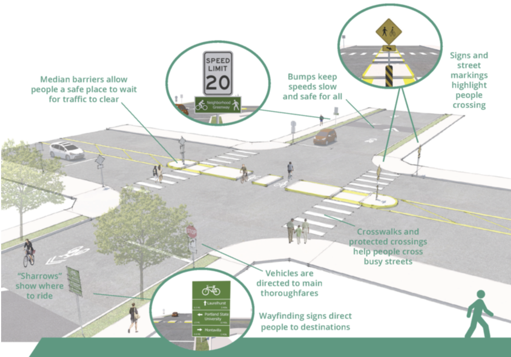
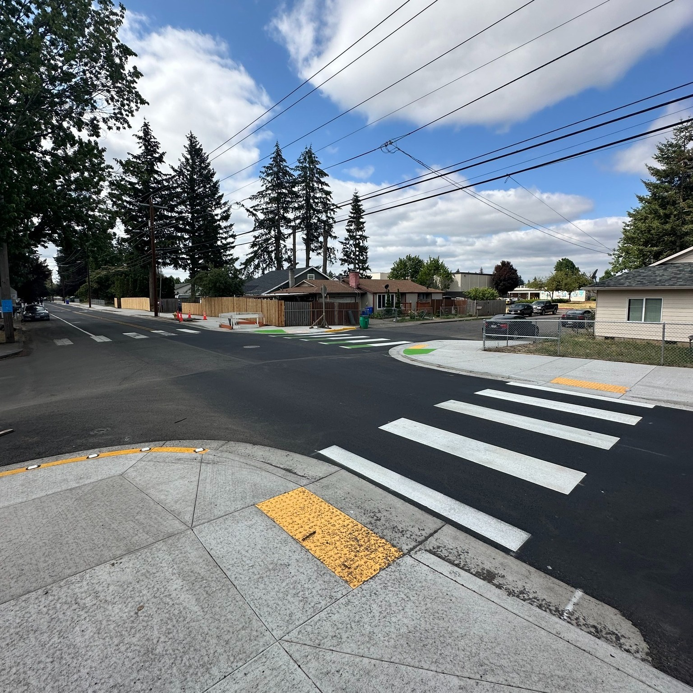
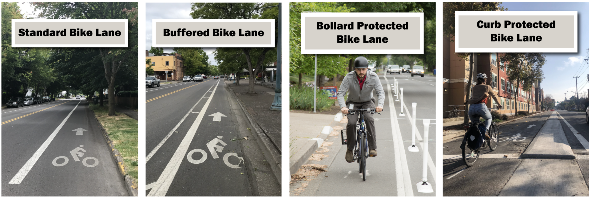

# Background  

Efforts to improve street safety for pedestrians and cyclists increasingly focus on the role of infrastructure design. While adding bicycle lanes, pedestrian crossings, and traffic calming features has become common practice in urban transportation planning, the effectiveness of these interventions depends on implementation quality, placement, and surrounding traffic conditions.  

Neighborhood greenways, introduced earlier as low-speed, low-traffic streets prioritizing people walking, biking, and rolling [@PBOTGreenways], are central to Portland’s active transportation approach. These routes rely on design elements such as speed bumps, traffic diverters, protected crossings, and wayfinding signage to create a connected, low-stress network for non-motorized travel (Figure 1).  

  

Complementing greenways, other traffic calming measures include curb extensions, raised crosswalks, and median islands, which improve visibility, shorten crossing distances, and reduce turning speeds (Figure 2).  

  

Protected bicycle infrastructure also plays a role. Portland employs a range of bikeway designs, from standard bike lanes to buffered, bollard-protected, and curb-protected facilities, each offering varying levels of physical separation from vehicle traffic (Figure 3).  

  

Since the early 2000s, the Portland Bureau of Transportation (PBOT) has expanded its greenway network to more than 100 miles and paired these investments with Vision Zero and Safe Routes to School initiatives [@PBOTGreenways]. These policies prioritize equitable access and the reduction of traffic-related fatalities, often focusing on high-risk intersections identified through crash data [@PBOTCrashStats].  

However, existing research offers mixed findings. While several studies associate protected bike lanes, lighting, and calming measures with reduced crash rates and severity [@Reynolds2009; @Lusk2011], others emphasize broader contextual factors such as traffic volume, land use, and roadway geometry [@ODOTInfrastructure]. These gaps highlight the need for localized, high-resolution analysis.  

This study addresses this gap by leveraging intersection-level crash and infrastructure data from 2007–2022 to examine how design interventions, particularly greenways and traffic calming measures, relate to safety outcomes for vulnerable road users.  
