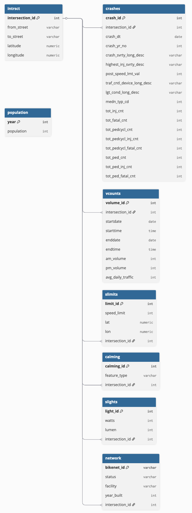

# Data & Data Engineering  

This project uses spatial and tabular datasets from public sources including the Oregon Department of Transportation (ODOT), the Portland Bureau of Transportation (PBOT), and Oregon’s GEOHub. Our analysis focuses on intersection-level crash patterns from 2007 to 2022 and integrates infrastructure, lighting, traffic volume, and speed environment data.  

Early consultations with Portland’s Vision Zero team and a senior transportation planner from Parametrix shaped our approach to sourcing, processing, and interpreting these datasets. These conversations clarified where infrastructure records were maintained, how features were applied in practice, and which fields best supported reliable spatial joins. They also highlighted common issues such as inconsistent street naming, missing coordinates, and duplicated records. This guidance informed our decision to build a normalized schema centered on a master `intrsct` table and to prioritize features most relevant to active transportation safety, including neighborhood greenways, traffic calming measures, and street lighting coverage.  

We created a fully normalized PostgreSQL database anchored by the `intrsct` table. All supporting datasets were standardized and aligned to **WGS 84 (World Geodetic System 1984)**, a global coordinate reference system used for latitude and longitude positioning. WGS 84 provides a common geographic framework that ensures spatial data from different sources can be accurately overlaid and compared. Once aligned, datasets were joined using either shared identifiers or proximity-based spatial joins. This unified structure allowed for consistent querying, accurate integration of diverse datasets, and intersection-level attribution across all features (Figure 4).  

### Crash Data (`crashes`)  
The `crashes` table contains more than 350,000 records from ODOT. Street names were standardized to ensure alignment across tables, entries lacking valid coordinates were removed and unmatched crashes were assigned an `intersection_id` through nearest-neighbor joins within 100 meters. Key fields include crash date (`crash_dt`), severity (`crash_svrty_long_desc`), highest injury severity (`highest_inj_svrty_desc`), and participant counts (`tot_pedcycl_cnt`, `tot_ped_cnt`).  

Crash data from 2020 and 2021 reflect atypical conditions caused by the COVID-19 pandemic, when traffic volumes declined sharply but crash severity often increased due to higher travel speeds on less congested roads. These years were retained in the dataset to preserve continuity across the study period, though their unique context is addressed in our Data Ethics discussion.  

### Bicycle Infrastructure (`network`)  
PBOT’s bicycle network dataset catalogs on-street bicycle facilities, including neighborhood greenways, bike lanes, buffered bike lanes, shared roadways, and multi-use paths. These facility types represent the range of infrastructure shown in Figure 3 of the Background section, from low-stress residential streets prioritized for bikes to higher-volume corridors with painted lanes or shared-use markings. The dataset includes attributes such as facility type (`facility`) and installation year (`year_built`). Records were standardized and spatially joined to intersections in `intrsct` to enable comparisons of crash outcomes across different infrastructure contexts.  

### Street Lighting (`slights`)  
The `slights` table includes point-level records of streetlights with attributes such as wattage (`watts`) and lumen output (`lumen`). Coordinates were transformed to WGS 84 and joined to their nearest intersection. Aggregated lighting measures, including total wattage and light counts per intersection, provide a proxy for illumination quality.  

### Traffic Calming Features (`calming`)  
The `calming` table documents physical features designed to slow or divert vehicle traffic, such as speed humps, raised crosswalks, curb extensions, and rumble strips. Each record includes a feature type (`feature_type`) and coordinates, which were spatially joined to `intrsct` to create intersection-level indicators of traffic calming. These features represent key tools used in Portland’s neighborhood greenways and local safety projects.  

### Traffic Volume (`vcounts`)  
The `vcounts` table provides vehicle counts by intersection, including AM and PM peak volumes (`am_volume`, `pm_volume`) and average daily traffic (`avg_daily_traffic`). These measures support crash rate calculations and help contextualize risk relative to traffic exposure.  

### Speed Limits (`slimits`)  
Initially excluded due to incomplete identifiers, speed limit data were later processed using proximity-based joins to assign posted speed values (`speed_limit`) to intersections. This variable supports analysis of speed environments in relation to crash frequency and severity.  

### Intersections (`intrsct`)  
The `intrsct` table, generated using the `osmnx` Python package and OpenStreetMap data, serves as the schema’s hub. Each record includes an `intersection_id`, intersecting street names (`from_street`, `to_street`), and geographic coordinates. All other tables are joined to this reference either directly or through spatial proximity.  

### Population (`population`)  
We incorporated citywide annual population estimates in a standalone table. While not tied to the intersection schema, these data enable per capita crash rate calculations and provide demographic context for temporal trends in transportation safety.  

### Excluded Data  
We excluded the `recommended_bicycle_routes` dataset due to overlap with PBOT’s bicycle network layer and its lack of unique detail. It could not be confidently joined and was unlikely to provide additional explanatory value beyond the infrastructure measures already included.  

### Schema Normalization  
All datasets were aligned to WGS 84, cleaned, and integrated into a relational structure centered on `intrsct`. Each table contains only fields relevant to analysis and uses consistent naming conventions. This schema enables accurate intersection-level attribution of crashes, infrastructure, and environmental features, supporting both descriptive analysis and modeling of safety outcomes.  

  

Together, these steps provided a cohesive database to support our analysis while also raising considerations about how these public datasets are constructed and what inherent limitations they may carry.  

## Data Ethics  

Because this project relies entirely on public data, privacy concerns are minimal. Crash records provided by ODOT are de-identified and contain no personally identifiable information, while infrastructure and traffic datasets describe physical features rather than individuals. However, ethical considerations arise in terms of representativeness, equity, and how these data reflect real-world conditions.  

In early conversations with the City of Portland’s Vision Zero team and a senior transportation planner from Parametrix, both emphasized that crash data are inherently incomplete and prone to bias. Many crashes go unreported, particularly those involving minor injuries or property damage. Underreporting disproportionately affects vulnerable populations, including low-income residents and people of color, who may have less trust in law enforcement or limited access to insurance and legal resources that drive formal reporting. This structural bias can skew analyses toward more severe collisions and better-resourced neighborhoods where reporting rates are higher. Similarly, infrastructure records reflect uneven investment patterns, with traffic calming features and greenways concentrated in inner neighborhoods while areas like East Portland remain underrepresented. These disparities create an equity concern because they risk reinforcing existing gaps in safety infrastructure.  

The COVID-19 pandemic further complicates interpretation of these data. Traffic volumes dropped sharply in 2020 and 2021, yet crash severity often increased due to higher travel speeds on less congested roads. These disruptions mean that crash trends during these years do not follow typical patterns, and including them without context could distort both descriptive findings and model performance. While we retained these years in our dataset to reflect the full study period, their unique conditions must be considered when interpreting results.  

Another limitation in assessing infrastructure effectiveness is the lag between installation and widespread user adoption. Even after new facilities are built, it often takes time for riders to learn how to navigate them or even become aware they exist. For example, PBOT published [guidance on how to use its new two-way bikeway and bike signal at NW Naito and Davis](https://www.portland.gov/transportation/news/2017/8/14/news-blog-how-it-works-pbots-new-two-way-bikeway-bike-and-right-turn), illustrating the need for active education when infrastructure is introduced. Similarly, ongoing advocacy around bike wayfinding reflects that many potential users remain unaware of greenway routes or how to access them. This adoption lag can delay observable safety benefits in crash data, meaning early analyses may underestimate the true long-term impact of improvements.  

Finally, our use of spatial joins introduces a methodological approximation. Assigning crashes and infrastructure features to intersections based on a 100-meter buffer was necessary for integration but can result in occasional misalignment in dense urban grids. While these joins were validated visually through mapping, they remain a source of potential imprecision.  

By explicitly acknowledging these factors, we aim to frame our findings responsibly. The relationships observed between infrastructure and crash outcomes are associative rather than causal, and any interpretation should consider the biases embedded in how transportation data are collected, reported, and shaped by external events and behavioral factors such as the pandemic and infrastructure adoption lag.  

# Data Engineering and Exploration  

Building this database required extensive preprocessing and integration across multiple spatial and tabular datasets. These steps were essential to ensure accurate intersection-level joins and to support subsequent exploratory analyses and modeling.  

## Data Engineering Workflow  

### Data Acquisition and Cleaning  
We obtained data from the Oregon Department of Transportation (ODOT), the Portland Bureau of Transportation (PBOT), and Oregon GEOHub in their original formats, including CSV files, shapefiles, and API outputs. Cleaning steps focused on aligning datasets both geographically and structurally. Crashes were filtered to include only those within Portland city limits and non-highway segments. Records with null or invalid coordinates, such as those present in the `crashes` and `slimits` tables, were removed. Street names were standardized across `crashes`, `network`, and `calming` to ensure join consistency. Categorical fields, such as traffic calming feature codes, were encoded uniformly, and naming inconsistencies (e.g., `WAY` versus `WY`) were corrected. For crashes without an initial intersection match, we used nearest-neighbor joins to impute `intersection_id` assignments, validating the resulting joins through interactive mapping. These processes reduced the crashes dataset from 356,280 metro-area records to 94,841 Portland-specific records suitable for integration with infrastructure layers.  

### Schema Integration  
We organized all datasets using a hub-and-spoke relational schema anchored by the `intrsct` table, which enabled scalable intersection-level analysis and efficient feature aggregation (Figure 4).  

### Feature Engineering  
We derived several intersection-level variables to capture infrastructure and environmental context. Lighting characteristics were aggregated from the `slights` table, including counts of streetlights and total wattage, to serve as proxies for illumination. Traffic calming features, such as speed humps, raised crosswalks, curb extensions, and rumble strips, were encoded as binary indicators from the `calming` table. Bicycle infrastructure was mapped using the `network` dataset, including the presence of neighborhood greenways and bike lanes, along with installation years to support pre- and post-installation comparisons. Speed environments were characterized by assigning posted speed limits from the `slimits` table via proximity-based joins. Traffic exposure was controlled through average daily traffic (ADT) data from `vcounts`. Additionally, crash severity was collapsed into an ordinal structure encompassing fatal, injury, and property-damage-only categories. Annual population estimates were included separately to provide per-capita context for citywide crash trends, although they were not directly tied to intersection-level records.  

### Data Validation  
Validation procedures confirmed the uniqueness of `intersection_id` values within the `intrsct` table and quantified the rate of unmatched joins. Approximately 25 percent of filtered crashes initially lacked an intersection match; these were reassigned using spatial proximity within a 100-meter buffer, with results verified through visual inspection in Leaflet. These steps ensured a robust, geographically coherent database suitable for subsequent exploratory analysis and modeling.  

This validated and normalized database provided the foundation for our exploratory data analysis, enabling intersection-level visualizations and statistical modeling of crash and infrastructure patterns.  
