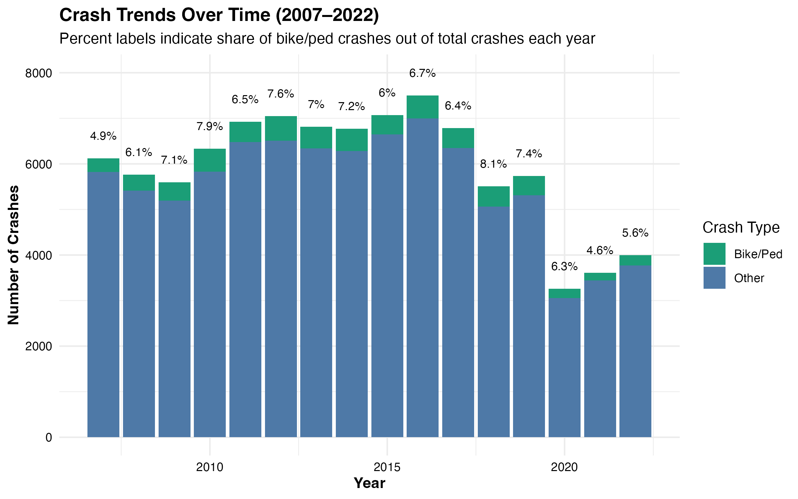
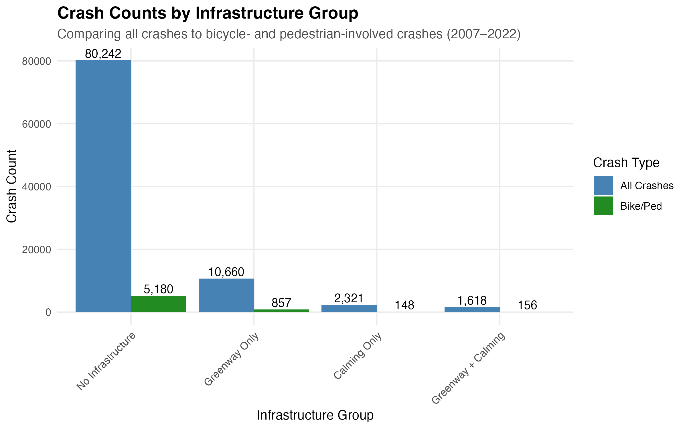
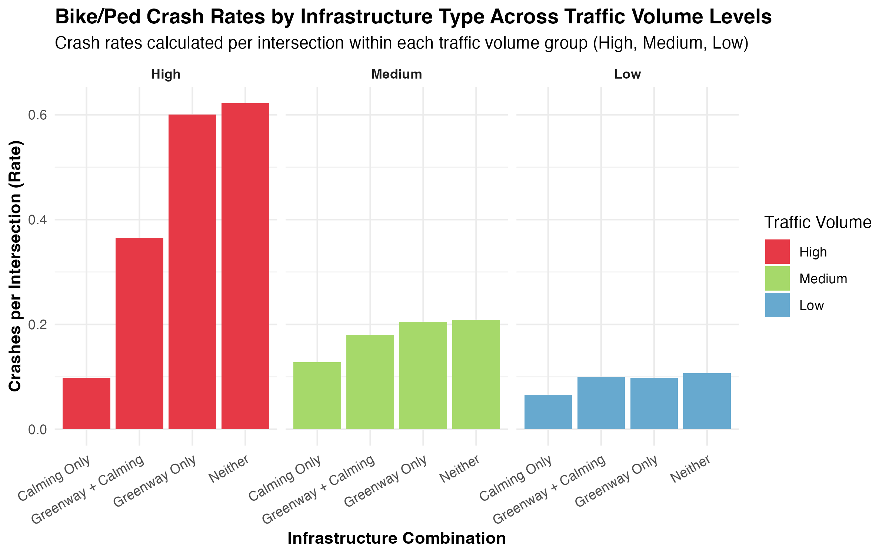
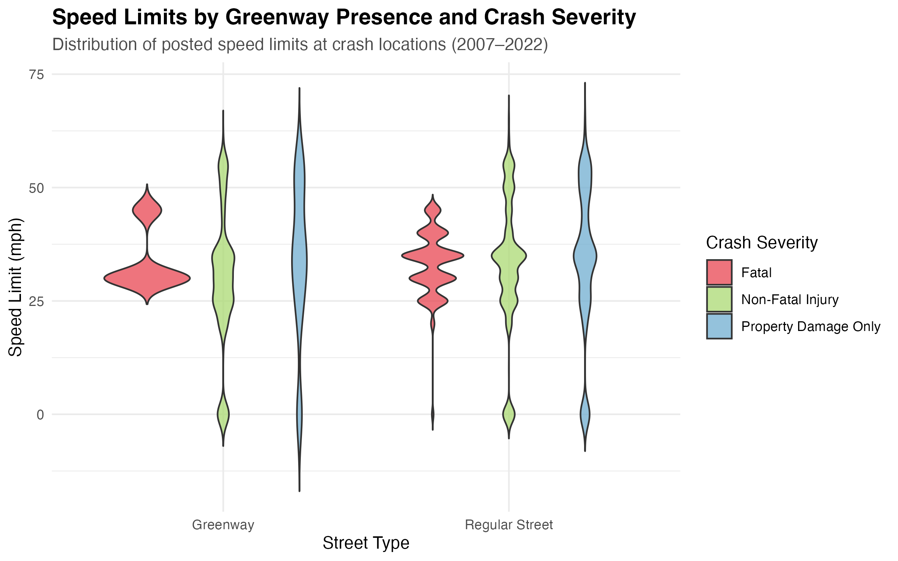

# Analysis

```{r}
library(car)
library(tidyverse)
library(DBI)
library(sf)
library(nngeo)
library(GGally)
library(lubridate)
library(janitor)
library(leaflet)
library(caret)
library(knitr)
con <- dbConnect(
  RPostgres::Postgres(),
  dbname = 'data510capstone',
  host = '100.127.69.80',
  port = 5432,
  user = 'thomas',
  password = 'thomas_noelle_capstone'
)
sql_crashes <- tbl(con, sql("SELECT * FROM crashes"))
sql_intrsct <- tbl(con, sql("SELECT * FROM intersections"))
sql_network <- tbl(con, sql("SELECT * FROM bicycle_network"))
sql_slimits <- tbl(con, sql("SELECT * FROM speed_limits"))
sql_slights <- tbl(con, sql("SELECT * FROM street_lights"))
sql_calming <- tbl(con, sql("SELECT * FROM traffic_calming_features"))
sql_vcounts <- tbl(con, sql("SELECT * FROM traffic_volume_counts"))
sql_population <- tbl(con, sql("SELECT * FROM portland_population"))
crashes <- collect(sql_crashes)
intrsct <- collect(sql_intrsct)
network <- collect(sql_network)
slimits <- collect(sql_slimits)
slights <- collect(sql_slights)
calming <- collect(sql_calming)
vcounts <- collect(sql_vcounts)
population <- collect(sql_population)
# Filter for city contains the string "Portland"
crashes <- crashes %>%
  filter(grepl("Portland", city_sect_nm))

# Trim white space
crashes$st_full_nm <- trimws(crashes$st_full_nm)
crashes$isect_st_full_nm <- trimws(crashes$isect_st_full_nm)

# Filters out rows where both are empty strings or both are NAs (25 + 57 = 82 filtered out).
crashes <- filter(crashes, !(st_full_nm == "" & isect_st_full_nm == ""))

# Deal with missing values for some predictors later on..
crashes$isect_typ_short_desc <- ifelse(
  is.na(crashes$isect_typ_short_desc),
  "UNKNOWN", crashes$isect_typ_short_desc
)
# If median type is unknown, then we assume no median.
crashes$medn_typ_long_desc <- ifelse(is.na(crashes$medn_typ_long_desc), "No median", crashes$medn_typ_long_desc)
# Assume if unknown, then probably not involved.
crashes$mj_invlv_flg <- ifelse(is.na(crashes$mj_invlv_flg), "No", crashes$mj_invlv_flg)

# Add relevant columns (some are grouped together, which helps later when we should reduce dimensions for machine learning model.)
crashes <- crashes %>%
  mutate(
    crash_date = as.Date(crash_dt),
    crash_day = day(crash_date),
    crash_month = month(crash_date, label = TRUE),
    bike_flg = ifelse(tot_pedcycl_cnt > 0 | tot_pedcycl_inj_cnt > 0 | tot_pedcycl_fatal_cnt > 0, 1, 0),
    ped_flg = ifelse(tot_ped_cnt > 0 | tot_ped_inj_cnt > 0 | tot_ped_fatal_cnt > 0, 1, 0),
    # Grouping together intersection type
    isect_group = ifelse(
      isect_typ_short_desc %in% c("5-LEG", "6-LEG", "7-LEG", "8-LEG", "9-LEG"),
      "GTE-5-LEG",
      isect_typ_short_desc
    ),
    # Grouping together hour of the day also
    crash_hr_grp = case_when(
      crash_hr_no >= 0  & crash_hr_no < 5  ~ "Late Night",
      crash_hr_no >= 5  & crash_hr_no < 7  ~ "Early Morning",
      crash_hr_no >= 7  & crash_hr_no < 9  ~ "Morning Rush",
      crash_hr_no >= 9  & crash_hr_no < 12 ~ "Late Morning",
      crash_hr_no >= 12 & crash_hr_no < 15 ~ "Midday",
      crash_hr_no >= 15 & crash_hr_no < 18 ~ "Afternoon Rush",
      crash_hr_no >= 18 & crash_hr_no < 22 ~ "Evening",
      crash_hr_no >= 22 & crash_hr_no <= 23 ~ "Night",
      # Unknown with a . because dummyVars function drops the first alphabetical column if multicollinearity.
      TRUE ~ ".Unknown"
    )
  )
crashes <- crashes %>% filter(!(hwy_compnt_long_desc %in% c("Connection", "Mainline State Highway")))
crashes$highest_inj_svrty_desc <- trimws(crashes$highest_inj_svrty_desc)
crashes$rd_char_grp <- fct_lump_prop(crashes$rd_char_long_desc, prop = .008)
crashes$wthr_cond_grp <- fct_lump_prop(crashes$wthr_cond_long_desc, prop = .01)
crashes <- crashes %>% mutate(wthr_cond_grp = fct_recode(wthr_cond_grp, Other = "Unknown"))
crashes$isect_group <- factor(
  crashes$isect_group,
  levels = c("CROSS", "UNKNOWN", "2-LEG", "3-LEG", "4-LEG", "GTE-5-LEG")
)
crashes$rd_char_grp <- factor(
  crashes$rd_char_grp,
  levels = c("Other", "Curve (horizontal curve)", "Driveway or Alley", "Intersection", "Straight Roadway")
)
crashes$wthr_cond_grp <- factor(
  crashes$wthr_cond_grp,
  levels = c("Other", "Clear", "Cloudy", "Rain", "Snow")
)
crashes$lgt_cond_long_desc <- factor(
  crashes$lgt_cond_long_desc,
  levels = c("Unknown", "Darkness - no street lights", "Darkness - with street lights", "Dawn (Twilight)", "Dusk (Twilight)", "Daylight")
)
slights$watts <- as.numeric(gsub("W", "", slights$watts))
slights$watts[is.na(slights$watts)] <- median(slights$watts, na.rm = TRUE)
calming$feature_type <- case_when(
  calming$feature_type == "3810" ~ "speed_bump",
  calming$feature_type == "3820" ~ "raised_crosswalk",
  calming$feature_type == "3830" ~ "textured_crosswalk",
  calming$feature_type == "3840" ~ "rumble_strip",
  TRUE ~ NA_character_  
)
vcounts_expanded <- vcounts %>%
  mutate(start_day = as.Date(startdate), end_day = as.Date(enddate)) %>%
  filter(!is.na(start_day), !is.na(end_day), start_day <= end_day) %>%
  mutate(date_seq = map2(start_day, end_day, ~ seq(.x, .y, by = "day"))) %>%
  unnest(date_seq) %>%
  select(-start_day, -end_day) %>%
  mutate(
    year = year(date_seq),
    month = month(date_seq, label = TRUE, abbr = TRUE),
    weekday = wday(date_seq, label = TRUE, abbr = TRUE),
    day = day(date_seq)
  )
crashes <- crashes %>%
  filter(!(str_ends(st_full_nm, "HY") | str_ends(isect_st_full_nm, "HY"))) %>%
  filter(isect_st_full_nm != "")
crashes_sf <- crashes %>%
  filter(is.na(intersection_id)) %>%
  st_as_sf(coords = c("longtd_dd", "lat_dd"), crs = 4326)
intrsct_sf <- intrsct %>%
  st_as_sf(coords = c("longitude", "latitude"), crs = 4326)
crashes_sf <- st_transform(crashes_sf, 3857)
intrsct_sf <- st_transform(intrsct_sf, 3857)
nearest <- st_nn(crashes_sf, intrsct_sf, k = 1, returnDist = TRUE, progress = FALSE)
crashes_sf$intersection_id <- intrsct$intersection_id[unlist(nearest$nn)]
crashes_sf$dist <- unlist(nearest$dist)
delta_meters <- 0.001 * 400000  # ~111 meters per degree
nearest_matches <- crashes_sf %>%
  filter(dist <= delta_meters) %>%
  st_drop_geometry() %>%
  select(crash_id, intersection_id)
crashes <- crashes %>%
  left_join(nearest_matches, by = "crash_id", suffix = c("", "_new")) %>%
  mutate(intersection_id = if_else(is.na(intersection_id), intersection_id_new, intersection_id)) %>%
  select(-intersection_id_new)
crashes <- crashes %>%
  filter(!is.na(intersection_id))
network_intrsct <- left_join(intrsct, network) %>%
  filter(!is.na(facility), status == "ACTIVE", is.na(year_retired)) %>%
  select(intersection_id, facility, year_built) %>%
  unique() %>%
  pivot_wider(names_from = facility, values_from = year_built)
slights_intrsct <- slights %>%
  group_by(intersection_id) %>%
  summarize(sum_watts = sum(watts), num_lights = n())
calming_intrsct <- calming %>%
  group_by(intersection_id, feature_type) %>%
  summarize(num_calming_features = n()) %>%
  pivot_wider(names_from = feature_type, values_from = num_calming_features)
crashes_all <- vcounts %>%
  group_by(intersection_id) %>%
  summarize(avg_daily_vol = mean(adt_volume)) %>%
  right_join(crashes)
intrsct_all <- intrsct %>%
  left_join(network_intrsct) %>%
  left_join(slimits %>% select(intersection_id, speed_limit)) %>%
  left_join(slights_intrsct) %>%
  left_join(calming_intrsct)
intrsct_all <- intrsct_all %>%
  mutate(across(where(is.numeric), ~replace_na(., 0)))
crashes_all <- left_join(crashes_all, intrsct_all)
crashes_all <- crashes_all %>%
  mutate(
    across(
      .cols = c(TRL, BL, PBL, BBL, BBBL, NG, ESR, SBBL, ABL),
      .fns = ~ map2_dbl(.x, crash_yr_no, ~ {
        candidates <- .x[.x <= .y]
        if (length(candidates) == 0) NA_real_ else max(candidates)
      }),
      .names = "{.col}_nt_yr"
    )
  )
crashes_all <- crashes_all %>%
  mutate(
    across(
      .cols = contains("_nt_yr"),
      .fns = ~ ifelse(is.na(.x), 0, 1),
      .names = "{.col}_flg"
    )
  )
crashes_all <- crashes_all %>%
  mutate(
    across(
      where(~ is.numeric(.x) && all(na.omit(.x) %in% c(0, 1))),
      ~ factor(.x, levels = c(0, 1), labels = c("No", "Yes"))
    )
  )
crashes_all$tot_pedcycl_fatal_cnt <- ifelse(as.character(crashes_all$tot_pedcycl_fatal_cnt) == "Yes", 1, 0)
crashes_all <- crashes_all %>%
  mutate(
    bike_ped_crash = if_else(
      tot_pedcycl_cnt > 0 | tot_pedcycl_inj_cnt > 0 | tot_pedcycl_fatal_cnt > 0 |
      tot_ped_cnt > 0 | tot_ped_inj_cnt > 0 | tot_ped_fatal_cnt > 0,
      1, 0
    ),
    has_calming = if_else(
      rowSums(across(
        c(speed_bump, raised_crosswalk, textured_crosswalk, rumble_strip),
        ~ as.numeric(.x)
      ), na.rm = TRUE) > 0,
      "Yes", "No"
    )
  )
crashes_predictors <- crashes_all %>%
  select(
    bike_flg, ped_flg,
    crash_wk_day_cd, crash_hr_no,
    # Numeric features that have many missing values...
    #avg_daily_vol
    # Experiment with high cardinality features?
    #crash_cause_1_long_desc,
    speed_limit, crash_svrty_long_desc, highest_inj_svrty_desc,
    isect_group, lgt_cond_long_desc, medn_typ_long_desc, rd_char_grp, rd_surf_med_desc,
    wthr_cond_grp, alchl_invlv_flg, drug_invlv_flg, mj_invlv_flg,
    crash_hit_run_flg, crash_speed_invlv_flg,
    sum_watts, num_lights, speed_bump, raised_crosswalk, rumble_strip, textured_crosswalk,
    TRL_nt_yr_flg, BL_nt_yr_flg, PBL_nt_yr_flg, BBL_nt_yr_flg, BBBL_nt_yr_flg, NG_nt_yr_flg,
    ESR_nt_yr_flg, SBBL_nt_yr_flg, ABL_nt_yr_flg
  ) %>%
  mutate(
    injured = crash_svrty_long_desc %in% c("Fatal", "Non-Fatal Injury"),
    fatal = crash_svrty_long_desc == "Fatal",
    major = highest_inj_svrty_desc %in% c("Fatal Injury (K)", "Suspected Serious Injury (A)", "Suspected Minor Injury Crash (B)")
  )
```


## Exploratory Data Analysis (EDA)

### Crash Trends  
As shown in **Figure 5**, annual crash counts have remained relatively stable over the study period, with a temporary decline during 2019 to 2021 coinciding with the COVID-19 pandemic. Bicycle and pedestrian-involved crashes consistently represent a small but steady share of all reported crashes.  

  

A heat density map (**Figure 6**) highlights clusters of bicycle and pedestrian-involved crashes across Portland, with concentrations most evident in the downtown core and along key corridors extending into outer neighborhoods. This visualization establishes a baseline view of where crashes are most frequent and sets the stage for examining how infrastructure and speed environments relate to these patterns.  

<iframe src="figures/heat-density.html" width="100%" height="600px" style="border:none;"></iframe>  
**Figure 6:** Heat density of bicycle and pedestrian-involved crashes across Portland.

### Crash Severity  
As shown in **Figure 7**, the distribution of injury severity shifts toward more serious outcomes for vulnerable road users. Compared to all crashes, bicycle and pedestrian-involved crashes rarely fall into the "no apparent injury/property damage only (PDO)" category and are far more likely to result in suspected minor or serious injuries, with fatalities present in smaller numbers. This pattern reflects the reality that collisions involving people on bikes or on foot almost always result in some degree of injury.

  

### Infrastructure Coverage and Grouping  
**Figure 8** shows that most crashes occurred at intersections without bicycle-specific infrastructure, reflecting both the broader street network composition and higher exposure along non-greenway routes. Intersections with greenways or calming features represented a much smaller share of crashes, consistent with their more limited coverage across the city. When greenways and calming features did overlap, crashes were comparatively rare, underscoring their intended role as lower-stress corridors. This figure shows crash counts rather than crash rates, providing a baseline view before incorporating traffic volume in the next section.  

  

### Crash Rates by Infrastructure and Traffic Volume  
Crash rates per intersection were examined across combined infrastructure groupings and stratified by traffic volume tertiles. As shown in **Figure 9**, rates were substantially higher in high-volume areas overall, but intersections with calming features—particularly those paired with greenways—experienced markedly fewer crashes than those lacking interventions.  

In medium- and low-volume areas, crash rates were much lower across all infrastructure types, and differences between groups were smaller. This suggests that infrastructure interventions may provide the greatest safety benefits where traffic exposure is highest and risk is more concentrated.  

  

### Speed Environment  
As shown in **Figure 10**, crashes on greenways are concentrated in lower speed environments, typically 20 to 25 mph, while crashes on regular streets span a wider range of posted speed limits, extending to 35 mph and above. Severe and fatal crashes are more common at the higher end of this range, reinforcing the established relationship between speed and injury severity.  

  

### Spatial Patterns  
The interactive map in **Figure 11** provides a citywide view of bicycle and pedestrian-involved crashes alongside Portland’s active transportation network. The map distinguishes **Neighborhood Greenways**, **other bike facilities**, and **off-street trails**, and overlays traffic calming features to show their distribution relative to crash locations.  

<iframe src="figures/spatial-map.html" width="100%" height="600px" style="border:none;"></iframe>  
**Figure 11:** Interactive map of bicycle and pedestrian-involved crashes, greenways, other bike facilities, off-street trails, and traffic calming features.

### Integrating Findings  
This exploratory analysis demonstrates that bicycle and pedestrian-involved crashes are most concentrated in high-speed, high-volume corridors with limited infrastructure, while intersections with greenways, calming features, and lower speed limits see fewer and less severe crashes. These insights directly informed our modeling approach, where we tested these relationships formally while controlling for traffic exposure and environmental context.


## Feature Importance Analysis

To better understand the relationship between relevant features and bicycle or pedestrian safety, this study explores the use of classification models to categorize crash severity. The primary focus is not predictive performance but rather the interpretation of feature importance. Nevertheless, the predictive strength of a model can still provide some indication of the strength of the underlying relationships between variables.

### Data Subsets

To enhance the accuracy and interpretability of predictive models for crash severity, this study employs both aggregate and disaggregated datasets. Specifically, models are trained on all crash data, bicycle-involved crashes, and pedestrian-involved crashes as separate subsets. This approach is grounded in the recognition that different road user types are subject to distinct risk profiles, behavioral dynamics, and environmental interactions.

Modeling all crashes provides a comprehensive understanding of severity factors across the full spectrum of road users. However, disaggregating the data by road user type allows the models to capture subgroup-specific patterns that may be obscured in the aggregate analysis. For instance, factors influencing injury severity in pedestrian-involved crashes, such as lighting conditions or road infrastructure features, may differ substantially from those relevant to motor vehicle collisions or bicycle-related incidents.

Disaggregating the data allows for the identification of road-user-specific risk factors that may be diluted or overlooked in models trained on the full dataset. By isolating the relationships between predictors and severity outcomes within bicycle- or pedestrian-involved crashes, the resulting feature importance measures can offer more targeted insights. This approach supports more nuanced interpretations of the data and facilitates the development of tailored safety interventions for each road user group.

### Target Variables

The target variable, crash severity, can be framed in a variety of different but related ways, each capturing a different aspect of the outcome. In this study, we examine three binary classification targets related to crash severity:

**Fatal Crash**: whether or not the crash resulted in a fatality.

**Injury Crash**: whether or not any injury was reported.

**Major Injury Crash**: whether the crash resulted in a severe injury, based on a consolidated classification.

For the third target, we group the injury types shown in Figure 2b into two broader categories: major injuries, comprising "Fatal Injury," "Suspected Serious Injury," and "Suspected Minor Injury"; and minor or no injuries, comprising "Possible Injury" and "No Apparent Injury." This aggregation reflects a simplified but relevant distinction between more and less severe injury outcomes.

Although all three targets serve as proxies for crash severity, each provides a unique lens for analysis. For instance, fatal crashes are rare but socially critical, while the injury-based targets may capture broader systemic risk patterns across road users.

Because all three targets exhibit varying degrees of class imbalance, particularly fatal crashes, model interpretation must be situated within the context of imbalanced learning. Figure [X] presents the distribution of each crash severity target by road user type to illustrate the degree of imbalance across populations.

```{r}
#| label: figure-6
#| fig-cap: "Proportion of Road User Crash Outcome by Type"
#| fig-align: center
crashes_predictors %>% 
  select(fatal, injured, major, bike_flg, ped_flg) %>%
  pivot_longer(cols = c(fatal, injured, major),
               names_to = "Target",
               values_to = "Target_Flag") %>%
  mutate(`Road User Type` = case_when(
    bike_flg == "Yes" ~ "Bike",
    ped_flg == "Yes" ~ "Pedestrian",
    TRUE ~ "Motorist"
  )) %>%
  group_by(Target, `Road User Type`, Target_Flag) %>%
  summarize(n = n(), .groups = "drop") %>%
  group_by(Target, `Road User Type`) %>%
  mutate(
    proportion = n / sum(n),
    Target = ifelse(Target == "major", "Major Injury", str_to_title(Target)),
    Target_Flag = str_to_title(Target_Flag),
    Target_Flag = factor(Target_Flag, levels = c("True", "False"))
  ) %>%
  mutate(
    label_position = cumsum(proportion) - (0.5 * proportion),
    label_text = ifelse(proportion > 0.03, paste0(scales::percent(proportion, accuracy = 0.1)), NA)
  ) %>%
  ggplot(aes(x = `Road User Type`, y = proportion, fill = Target_Flag)) +
    geom_col(position = "stack", width = 0.75) +
    facet_wrap(~ Target) +
    labs(title = "",
         x = "Road User Type",
         y = "",
         fill = "Flag (True = Belongs to Target Category)") +
    scale_y_continuous(labels = scales::percent_format()) +
    scale_fill_manual(values = c("skyblue2", "red2")) +
    geom_text(
      aes(y = label_position, label = label_text),
      color = "black",
      size = 3.5,
      position = "identity"
    ) +
    theme_bw() +
    theme(
      axis.text.x = element_text(size = 11),
      panel.grid.major.x = element_blank(),
      legend.position = "top",
      legend.title = element_text(face = "bold"),
      strip.text = element_text(size = 12),
      strip.background = element_rect(fill = "gray95")
    )
```

Of significant note is the class imbalance between fatal and non-fatal car crashes. Of the 94,841 crashes in the final dataset, 373 (~0.4%) were fatal. Of those, 23 were bicycle crashes, and 148 were pedestrian crashes. The class imbalance persists for Bicycle, Pedestrian, and Motorists.

Unsurprisingly, most reported crashes that involve a bicycle or pedestrian also involve an injury. The remaining class imbalance for motorists is roughly divided in two, which justifies the class balance when training a model on all crashes rather than subsets of bicycles or pedestrians. 

On the other hand, by composing a feature of injury severity as explained above, the class balance between major and minor injuries for bikes and pedestrians are far more comparable.

### Predictor Subsets

Given the complexity and variation across road users and crash severity outcomes, it is equally important to consider the types of predictors used in modeling. To address this, we implement two modeling strategies: one utilizing all available predictors, and another constrained to infrastructure-specific features (e.g., speed limits, bike lanes, lighting levels).

While models with all predictors allow for a more complete understanding of the multifaceted contributors of crash severity, they may also incorporate variables that are less actionable from a planning or policy standpoint. In contrast, infrastructure-only models are designed to isolate the influence of modifiable aspects of the built environment, which are most relevant to decision-makers in transportation planning and roadway design.

By comparing the feature importance outputs from these two model types, we can assess the extent to which crash severity can be explained by infrastructure alone, versus more complex contextual or behavioral variables. This dual approach supports both broad analytical insight and practical, intervention-oriented recommendations.

### Modeling

Given the central importance of feature importance in this study, we selected classification models that facilitate interpretable insights into the predictors of crash severity. Four modeling techniques were employed: Random Forest, Logistic Regression, and Logistic Regression with LASSO and Ridge regularization. These methods were chosen to provide multiple perspectives on variable importance while also balancing model simplicity and interpretability.

Models were trained for each combination of data subsets (all crashes, bicycle-involved crashes, pedestrian-involved crashes), target outcomes (injury vs. non-injury, fatal vs. non-fatal, degree of injury), predictor subsets (all features versus infrastructure-specific features), and model type. Each model was trained and evaluated using a five-fold cross-validation scheme on an 80/20 train-test split.

To account for class imbalances common in crash severity data, model performance was assessed using Cohen’s Kappa statistic rather than standard accuracy metrics. This choice enables a more reliable evaluation of predictive agreement beyond random chance.

To assess model stability and the consistency of feature importance, each model configuration was trained and evaluated across five iterations with different random seeds. For each configuration, the minimum and maximum Kappa values are reported, along with the three most influential features determined by a majority vote across iterations. This framework yields a detailed comparison of model performance and key predictors across varying data partitions and model specifications.


